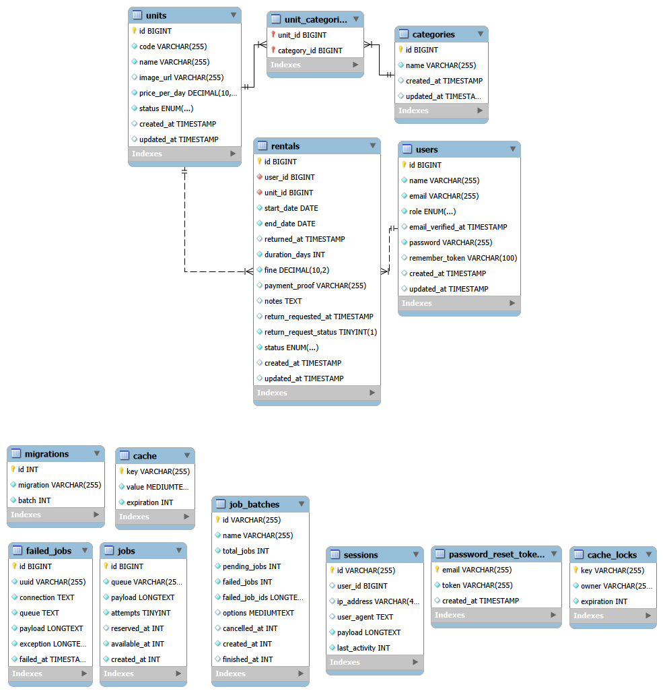

# 🌍 Website Sewa Planet

## 👥 Nama Kelompok
Stellar 

## 🧑‍💻 Nama Team
1. Nevin Athalla Sukandar — Fullstack Developer 

## 🪐 Nama Project
**Website Sewa Planet**  
Website ini dibuat dengan tema Sistem Sewa Planet.
Sistem ini memungkinkan pengguna untuk menyewa unit planet (contoh: Planet Mars, Saturnus, Jupiter, dsb.) dengan batas waktu tertentu, serta mengatur proses pengelolaan oleh admin. Sistem ini berbasis web menggunakan Laravel 12, Bootstrap, dan MySQL.  

---

## ⚙️ List Fitur
1. Terdapat dua jenis anggota yaitu **Admin** dan **User (anggota)**.  
2. Setiap **User harus login** untuk dapat mengakses website.  
3. **User harus terdaftar** sebagai anggota untuk dapat melakukan penyewaan unit.  
4. **Satu user hanya memiliki satu profil** dan dapat mengubah profilnya sendiri.  
5. Setiap **unit dapat memiliki lebih dari satu kategori**.  
6. **Nama unit dapat sama**, tetapi dibedakan melalui **kode unit unik** (kode unit tidak boleh sama).  
7. User dapat melakukan **pencarian unit berdasarkan nama unit**.  
8. **Admin dapat:**
   - Menambah data unit, kategori, dan user (anggota).  
   - Mengupdate data unit, kategori, dan user (anggota).  
   - Menghapus data unit, kategori, dan user (anggota).  
9. **User hanya dapat meminjam maksimal 2 unit**.  
10. **Pinjaman maksimal 5 hari.** Jika melebihi batas waktu, maka akan dikenakan **denda**.  
11. **Hanya Admin** yang dapat melakukan **pengembalian unit** — anggota harus menghubungi Admin jika ingin mengembalikan unit. **Member dapat mengirim request pengembalian dengan upload bukti pembayaran, kemudian Admin memverifikasi dan mengembalikan unit.**  
12. **Admin dapat melihat daftar unit yang sedang dipinjam.**  
13. **User hanya dapat melihat daftar unit yang dipinjam olehnya sendiri.**  
14. **Admin dapat melihat dan mencetak riwayat peminjaman unit dari user (anggota).**  
15. Terdapat **validasi pada setiap field penting (required)** untuk memastikan data tidak kosong.  
16. Dibuat **tabel migration** sesuai kebutuhan sistem (users, categories, units, rentals).  
17. Dibuat **data seeder** awal untuk:
    - User admin.  
    - Kategori unit.  
    - Daftar unit awal.  

---

## 🎨 Tampilan User Interface

### Homepage Member

*Halaman utama untuk member dengan daftar planet yang tersedia untuk disewa. Fitur pencarian planet berdasarkan nama dan kategori.*

### Dashboard Admin

*Dashboard admin dengan statistik lengkap: total planet, kategori, member, sewa aktif, planet terlambat, dan total denda. Admin dapat mengelola semua data unit, kategori, user, dan transaksi sewa.*

---

## 🧱 Screen Capture Skema Database

### 📊 Struktur Database (11 Tabel)

#### **Tabel Bisnis Utama**

**1. users** - Data pengguna (admin & member)
- `id` (bigint, PK)
- `name` (varchar) - Nama lengkap pengguna
- `email` (varchar, unique) - Email untuk login
- `email_verified_at` (timestamp, nullable)
- `password` (varchar) - Password terenkripsi
- `role` (enum: 'admin', 'member') - Role pengguna
- `remember_token` (varchar, nullable)
- `created_at`, `updated_at` (timestamp)

**2. categories** - Kategori planet (contoh: Terestrial, Gas Giant, Ice Giant)
- `id` (bigint, PK)
- `name` (varchar) - Nama kategori
- `created_at`, `updated_at` (timestamp)

**3. units** - Data unit planet yang dapat disewa
- `id` (bigint, PK)
- `code` (varchar, **unique**) - Kode unik planet (contoh: PLT-001)
- `name` (varchar) - Nama planet (boleh duplikat)
- `image_url` (varchar, nullable) - URL gambar planet
- `price_per_day` (decimal 10,2, default 0) - Harga sewa per hari
- `status` (enum: 'available', 'rented') - Status ketersediaan
- `created_at`, `updated_at` (timestamp)

**4. unit_categories** - Tabel pivot (Many-to-Many)
- `unit_id` (bigint, FK → units.id)
- `category_id` (bigint, FK → categories.id)
- Primary Key: Composite (unit_id, category_id)
- Relasi: Satu unit dapat memiliki banyak kategori

**5. rentals** - Transaksi peminjaman planet
- `id` (bigint, PK)
- `user_id` (bigint, FK → users.id, cascade delete)
- `unit_id` (bigint, FK → units.id, cascade delete)
- `start_date` (date) - Tanggal mulai sewa
- `end_date` (date) - Tanggal jatuh tempo
- `duration_days` (integer) - Durasi sewa (hari)
- `returned_at` (timestamp, nullable) - Tanggal dikembalikan
- `fine` (decimal 10,2, default 0) - Denda keterlambatan (Rp 100.000/hari)
- `payment_proof` (varchar, nullable) - Bukti pembayaran saat return
- `notes` (text, nullable) - Catatan member saat request return
- `return_requested_at` (timestamp, nullable) - Waktu request return
- `return_request_status` (boolean, default false) - Status request return
- `status` (enum: 'ongoing', 'returned') - Status peminjaman
- `created_at`, `updated_at` (timestamp)

#### **Tabel Sistem Laravel**

**6. sessions** - Sesi login pengguna (Laravel session driver)
- `id` (varchar, PK)
- `user_id` (bigint, nullable, FK → users.id)
- `ip_address` (varchar, nullable)
- `user_agent` (text, nullable)
- `payload` (longtext)
- `last_activity` (integer, indexed)

**7. cache** - Cache data aplikasi
- `key` (varchar, PK)
- `value` (mediumtext)
- `expiration` (integer)

**8. cache_locks** - Lock untuk cache
- `key` (varchar, PK)
- `owner` (varchar)
- `expiration` (integer)

**9. password_reset_tokens** - Token reset password
- `email` (varchar, PK)
- `token` (varchar)
- `created_at` (timestamp, nullable)

**10. failed_jobs** - Log job yang gagal
- `id` (bigint, PK)
- `uuid` (varchar, unique)
- `connection` (text)
- `queue` (text)
- `payload` (longtext)
- `exception` (longtext)
- `failed_at` (timestamp, default CURRENT_TIMESTAMP)

**11. jobs** - Antrian job Laravel (jika menggunakan queue)
- `id` (bigint, PK)
- `queue` (varchar, indexed)
- `payload` (longtext)
- `attempts` (tinyint unsigned)
- `reserved_at` (integer unsigned, nullable)
- `available_at` (integer unsigned)
- `created_at` (integer unsigned)

### 🔗 Relasi Antar Tabel

**One-to-Many (1:N)**
1. `users` → `rentals` (Satu user dapat memiliki banyak rental)
2. `units` → `rentals` (Satu unit dapat disewa berkali-kali)
3. `users` → `sessions` (Satu user dapat memiliki banyak sesi login)

**Many-to-Many (M:N)**
1. `units` ↔ `categories` (via tabel pivot `unit_categories`)
   - Satu unit dapat memiliki banyak kategori
   - Satu kategori dapat dimiliki banyak unit

**Foreign Key Constraints**
- `rentals.user_id` → `users.id` (ON DELETE CASCADE)
- `rentals.unit_id` → `units.id` (ON DELETE CASCADE)
- `unit_categories.unit_id` → `units.id` (ON DELETE CASCADE)
- `unit_categories.category_id` → `categories.id` (ON DELETE CASCADE)

### ✨ Fitur Khusus Database

**1. Return Request System (4 kolom di tabel rentals)**
- Member dapat request pengembalian dengan upload bukti pembayaran
- Workflow: `payment_proof` → `notes` → `return_requested_at` → `return_request_status`
- Admin verifikasi dan approve pengembalian

**2. Flexible Pricing**
- `units.price_per_day`: Setiap planet dapat memiliki harga berbeda
- Denda keterlambatan: Rp 100.000/hari (otomatis dihitung)

**3. Soft Constraints (Business Logic)**
- Max 2 unit per member (validated di controller)
- Max 5 hari rental duration (validated di form)
- `units.code` UNIQUE, tetapi `units.name` boleh duplikat (sesuai requirement LSP)

### 📈 Statistik Database
- **Total Tabel:** 11 (5 bisnis + 6 sistem)
- **Total Foreign Keys:** 4 dengan CASCADE delete
- **Total Unique Constraints:** 3 (users.email, units.code, failed_jobs.uuid)
- **Pivot Table:** 1 (unit_categories dengan composite PK)  

---

## 🎥 Screen Recorder Demo
📹 [Tautan Video Demo Website Sewa Planet](https://drive.google.com/file/d/1j6a-9k3lJUf2RK8oFeINdrSJa31wfwrB/view?usp=drive_link)

Video berisi penjelasan alur penggunaan website:
- Login dan register user  
- Melihat dan mencari unit  
- Melakukan peminjaman  
- Melihat daftar unit yang dipinjam  
- Pengembalian unit oleh admin  
- Laporan riwayat peminjaman  
