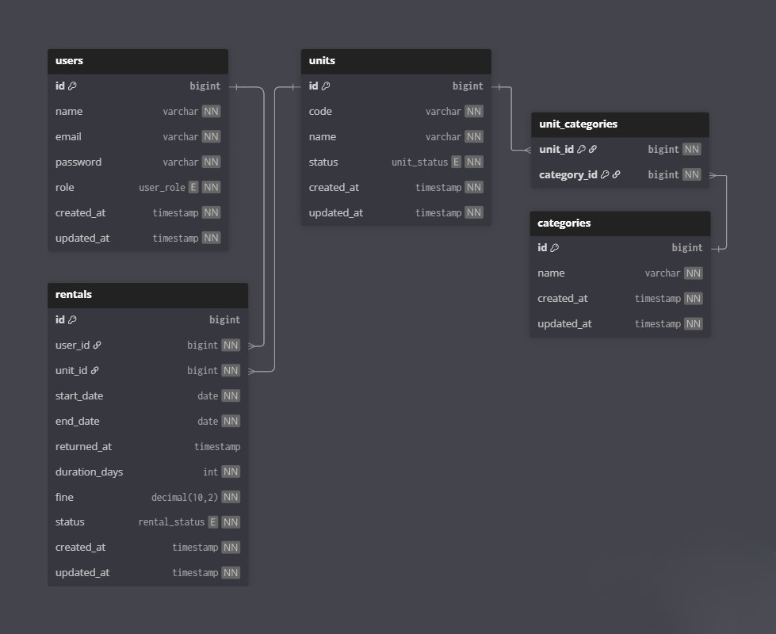

# 🌍 Website Sewa Planet

## 👥 Nama Kelompok
Stellar 

## 🧑‍💻 Nama Team
1. Nevin Athalla Sukandar — Fullstack Developer 

## 🪐 Nama Project
**Website Sewa Planet**  
Website ini dibuat untuk memenuhi ujian LSP Bidang Web Developer dengan tema Sistem Sewa Planet.
Sistem ini memungkinkan pengguna untuk menyewa unit planet (contoh: Planet Mars, Saturnus, Jupiter, dsb.) dengan batas waktu tertentu, serta mengatur proses pengelolaan oleh admin. Sistem ini berbasis web menggunakan Laravel 12, Bootstrap, dan MySQL.  

---

## ⚙️ List Fitur
1. Terdapat dua jenis anggota yaitu **Admin** dan **User (anggota)**.  
2. Setiap **User harus login** untuk dapat mengakses website.  
3. **User harus terdaftar** sebagai anggota untuk dapat melakukan penyewaan unit.  
4. **Satu user hanya memiliki satu profil** dan dapat mengubah profilnya sendiri.  
5. Setiap **unit dapat memiliki lebih dari satu kategori**.  
6. **Nama unit dapat sama**, tetapi dibedakan melalui **kode unit unik** (kode unit tidak boleh sama).  
7. User dapat melakukan **pencarian unit berdasarkan nama unit**.  
8. **Admin dapat:**
   - Menambah data unit, kategori, dan user (anggota).  
   - Mengupdate data unit, kategori, dan user (anggota).  
   - Menghapus data unit, kategori, dan user (anggota).  
9. **User hanya dapat meminjam maksimal 2 unit**.  
10. **Pinjaman maksimal 5 hari.** Jika melebihi batas waktu, maka akan dikenakan **denda**.  
11. **Hanya Admin** yang dapat melakukan **pengembalian unit** — anggota harus menghubungi Admin jika ingin mengembalikan unit.  
12. **Admin dapat melihat daftar unit yang sedang dipinjam.**  
13. **User hanya dapat melihat daftar unit yang dipinjam olehnya sendiri.**  
14. **Admin dapat melihat dan mencetak riwayat peminjaman unit dari user (anggota).**  
15. Terdapat **validasi pada setiap field penting (required)** untuk memastikan data tidak kosong.  
16. Dibuat **tabel migration** sesuai kebutuhan sistem (users, categories, units, rentals).  
17. Dibuat **data seeder** awal untuk:
    - User admin.  
    - Kategori unit.  
    - Daftar unit awal.  

---

## 🧱 Screen Capture Skema Database

Keterangan tabel:
- **users:** id, name, email, password, role  
- **categories:** id, name  
- **units:** id, code, name, category_id, status  
- **rentals:** id, user_id, unit_id, start_date, end_date, fine  

---

## 🎥 Screen Recorder Demo (Work in Progress)
📹 [Tautan Video Demo Website Sewa Planet](https://drive.google.com/file/d/DEMO_LINK)

Video berisi penjelasan alur penggunaan website:
- Login dan register user  
- Melihat dan mencari unit  
- Melakukan peminjaman  
- Melihat daftar unit yang dipinjam  
- Pengembalian unit oleh admin  
- Laporan riwayat peminjaman  
